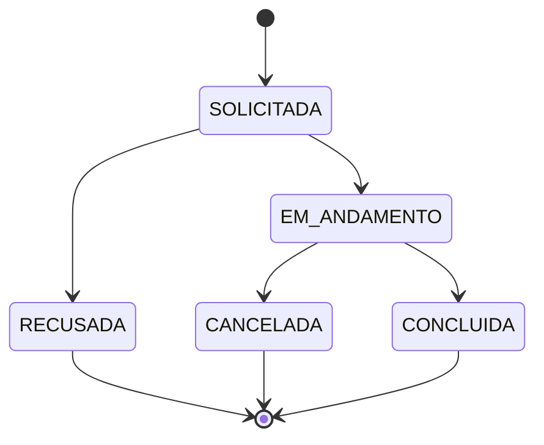

- **SOLICITADA** — o interessado pediu a adoção. O doador ainda não respondeu.
- **EM_ANDAMENTO** — o doador aceitou o pedido. As partes estão combinando a entrega.
- **CONCLUIDA** — o animal foi entregue. Estado terminal, e o único que libera avaliação.
- **RECUSADA** — o doador negou o pedido. Estado terminal.
- **CANCELADA** — desistência de qualquer uma das partes depois do aceite. Estado terminal.

## Sincronia com o anúncio

Adoção e anúncio são máquinas de estado separadas, mas não independentes. As regras que ligam as duas:

| Evento na adoção | Efeito obrigatório no anúncio |
| --- | --- |
| `SOLICITADA` criada | anúncio permanece `ATIVO` |
| `EM_ANDAMENTO` | anúncio permanece `ATIVO` |
| `CONCLUIDA` | anúncio vai para `RESOLVIDO` |
| `RECUSADA` / `CANCELADA` | anúncio volta a aceitar novas solicitações |

Restrições que decorrem disso:

- Só um anúncio em `ATIVO` aceita nova adoção `SOLICITADA`.
- No máximo uma adoção `EM_ANDAMENTO` ou `CONCLUIDA` por anúncio. Várias `SOLICITADA` podem coexistir — é o doador quem escolhe entre os interessados.
- Uma adoção `CONCLUIDA` nunca volta atrás. Devolução do animal é um anúncio novo, não uma reversão de estado.

Ver [[Fluxo Status de Anuncio]] para o ciclo de vida do anúncio.

## Por que `Animais` não tem status

O estado do animal é derivado, não armazenado. Guardar uma coluna `Status` em `Animais` criaria uma terceira fonte de verdade sobre o mesmo fato, e nada no banco impediria a combinação impossível de animal marcado como "adotado" com anúncio ainda `ATIVO`.

O estado do animal se lê assim:

| Situação | Como derivar |
| --- | --- |
| Disponível para adoção | existe anúncio `ATIVO` do tipo `ADOCAO` |
| Perdido | existe anúncio `ATIVO` do tipo `PERDIDO` |
| Encontrado, procurando tutor | existe anúncio `ATIVO` do tipo `ENCONTRADO` |
| Adotado | existe adoção `CONCLUIDA` |
| Apenas cadastrado | nenhum anúncio associado |

Ver [[Tipos Anuncio]] para os tipos de anúncio.
