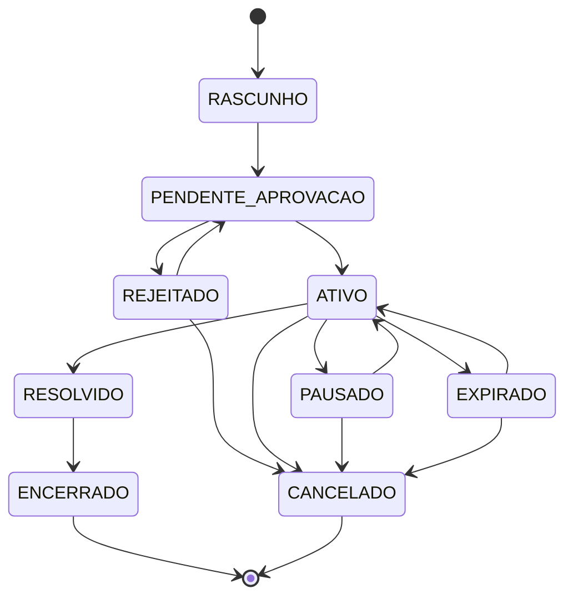

## Os estados

| Estado | Significado | Quem provoca |
| --- | --- | --- |
| `RASCUNHO` | Em edição, ainda não enviado. Não aparece para ninguém. | autor |
| `PENDENTE_APROVACAO` | Enviado, aguardando moderação. | autor |
| `REJEITADO` | Moderação recusou. O motivo fica em `Moderações`. | moderador |
| `ATIVO` | Aprovado e publicado, visível no catálogo. | moderador |
| `PAUSADO` | Retirado temporariamente do catálogo pelo autor. | autor |
| `EXPIRADO` | Passou do prazo sem resolução. Sai do catálogo. | sistema |
| `RESOLVIDO` | Adoção concluída, ou animal reencontrado. | sistema / autor |
| `ENCERRADO` | Arquivado. Estado terminal. | sistema |
| `CANCELADO` | Autor desistiu. Estado terminal. | autor |

## Por que não existe um estado `APROVADO`

A publicação é automática: assim que o moderador aprova, o anúncio já vai ao ar. Um estado `APROVADO` entre `PENDENTE_APROVACAO` e `ATIVO` nunca seria ocupado por nenhuma linha — as duas transições acontecem na mesma operação.

Estado que ninguém ocupa é peso morto no enum e gera dúvida na hora de investigar problema. O registro de que houve aprovação não depende dele: fica em `Aprovado por`, `Aprovado em` e na tabela `Moderações`.

## Pausar não perde a aprovação

Se o autor pausa o anúncio, ele não pode voltar para `PENDENTE_APROVACAO` e cair de novo na fila de moderação.

O fluxo resolve isso porque `PAUSADO` só é alcançável a partir de `ATIVO`, e `PAUSADO` volta para `ATIVO` — nunca para a fila. O mesmo vale para `EXPIRADO`.

Além disso, o fato de ter sido aprovado não depende do campo de status: fica registrado em `Aprovado por`, `Aprovado em` e na tabela `Moderações`. Mesmo que o estado atual mude várias vezes, o histórico da moderação permanece.

## Reenvio depois da rejeição

`REJEITADO → PENDENTE_APROVACAO` existe para o autor corrigir o que foi apontado e reenviar. Cada passagem pela moderação gera uma linha nova em `Moderações`, então o histórico de idas e vindas fica preservado.

`REJEITADO → CANCELADO` é a saída de quem desistiu.

## Expiração

`EXPIRADO` evita que anúncio de animal perdido nunca reencontrado fique visível para sempre. O anúncio sai do catálogo mas não é apagado, e o autor pode renovar (`EXPIRADO → ATIVO`).

O prazo é regra de aplicação, não do banco.

Ver [[Tipos Anuncio]] para os tipos de post e [[Fluxo Status de Adocao]] para o ciclo da adoção.
